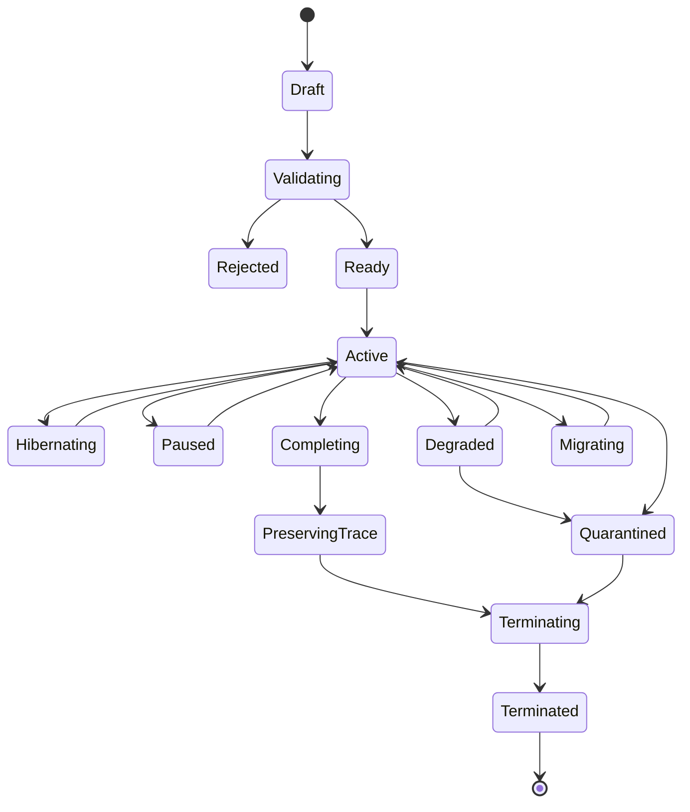
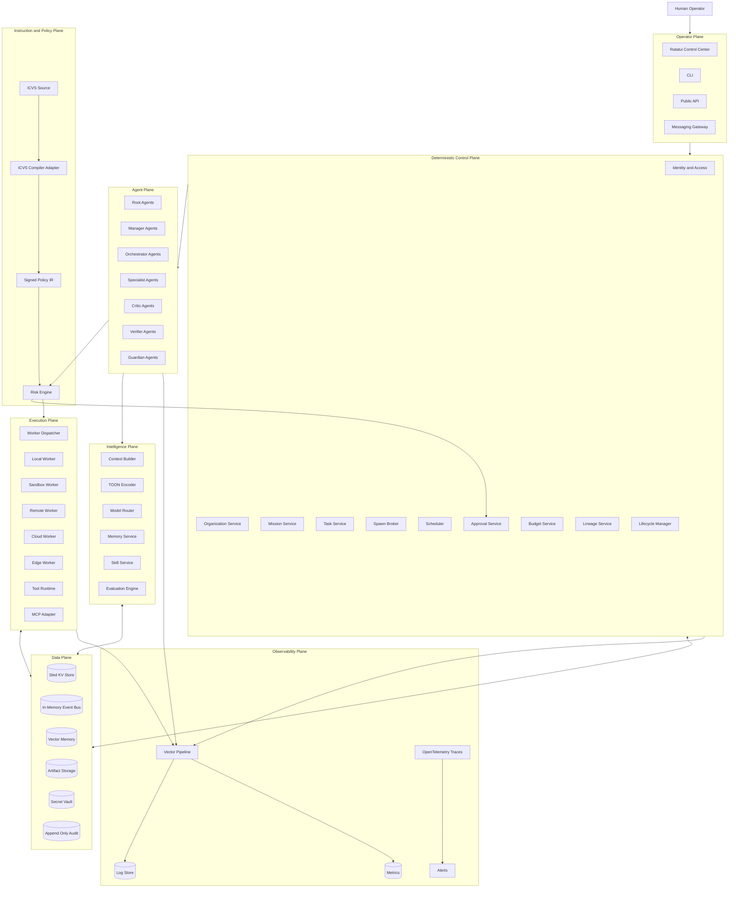
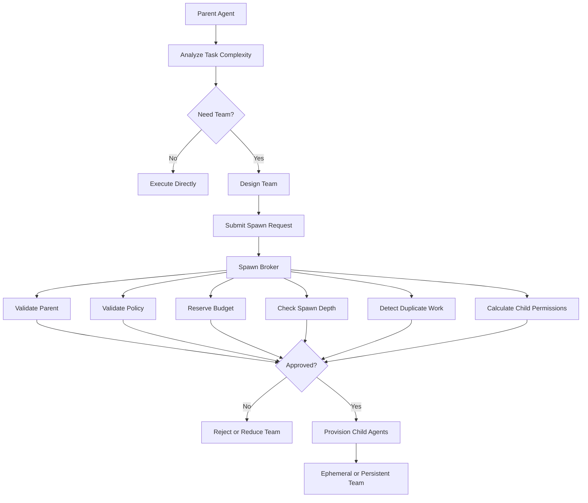

# 11. Model Kehidupan Agen

## 11.1 Ephemeral Mode

Ephemeral Agent memiliki:

* satu objective;
* task binding;
* TTL;
* budget;
* maximum turn;
* termination rule;
* limited memory scope.

Agent berakhir setelah:

* task diterima verifier;
* objective dibatalkan;
* TTL habis;
* budget habis;
* parent dihentikan;
* operator menghentikan agent;
* policy violation;
* agent menjadi duplikat.

## 11.2 Persistent Mode

Persistent Agent mempertahankan:

* identity;
* role;
* reporting line;
* mission ownership;
* memory namespace;
* reputation;
* policy profile;
* budget cycle;
* checkpoint;
* schedule;
* subscriptions.

Persistent Agent mendukung tiga pola.

### Always On

Agent tersedia 24/7 dan menerima event kapan saja.

### Scheduled

Agent bangun berdasarkan jadwal.

### Campaign

Agent hidup hingga tanggal atau objective jangka panjang tercapai.

## 11.3 Hibernating Persistent Agent

Persistent Agent dapat tidur tanpa process aktif.

Saat hibernasi:

* identity tetap aktif;
* event subscription tetap terdaftar;
* memory tetap tersedia;
* runtime lease dilepas;
* model tidak dipanggil;
* biaya compute berhenti;
* scheduler dapat membangunkan agent.

## 11.4 Hybrid Team

Persistent Parent dapat membuat ephemeral children untuk tugas harian.

```text
Persistent Operations Manager
├── Ephemeral Incident Team
├── Ephemeral Reporting Team
├── Persistent Monitoring Agent
└── Scheduled Audit Agent
```

---

# 12. Agent Lifecycle State



## 12.1 Migrating

Persistent Agent dapat berpindah dari satu worker ke worker lain.

Proses migrasi:

1. freeze task claim;
2. buat checkpoint;
3. tutup runtime lama;
4. pindahkan state;
5. validasi policy;
6. buat runtime baru;
7. resume subscription;
8. lanjutkan task.

---

# 13. Arsitektur Tingkat Tinggi



---

# 14. Organization Model

Satu tenant dapat memiliki beberapa organization.

Organization memiliki:

* mission statement;
* departments;
* roles;
* reporting lines;
* human members;
* agent members;
* budgets;
* policies;
* tools;
* data boundaries.

Contoh:

```text
Organization
├── Board
├── Executive Department
│   └── Persistent Director Agent
├── Engineering Department
│   ├── Persistent Engineering Manager
│   └── Ephemeral Project Teams
├── Research Department
├── Security Department
├── Operations Department
└── Audit Department
```

Human dan agent dapat berada dalam struktur yang sama.

---

# 15. Agent Types

## 15.1 Root Agent

Menerima goal manusia dan memulai mission.

## 15.2 Director Agent

Mengatur beberapa workstream dan persistent department.

## 15.3 Planner Agent

Membentuk task graph dan kebutuhan team.

## 15.4 Orchestrator Agent

Dapat membuat child agents dan mengoordinasikan swarm.

## 15.5 Specialist Agent

Menjalankan keahlian tertentu.

## 15.6 Critic Agent

Mencari kelemahan pada output.

## 15.7 Verifier Agent

Memeriksa acceptance criteria dan evidence.

## 15.8 Judge Agent

Membandingkan beberapa solusi.

## 15.9 Security Guardian

Memberikan risk analysis dan anomaly signal.

## 15.10 Memory Curator

Menilai kandidat memory.

## 15.11 Skill Engineer

Membentuk candidate skill.

## 15.12 Cost Controller

Memantau cost velocity dan loop.

## 15.13 Recovery Agent

Menangani task atau runtime yang gagal.

## 15.14 Watcher Agent

Persistent agent yang memantau kondisi tertentu.

## 15.15 Maintenance Agent

Menangani pekerjaan berkala, health check, dan cleanup.

---

# 16. Agent Genome

Agent Genome adalah template pembentukan agent.

```yaml
api_version: claw10/v1
kind: AgentGenome

metadata:
  id: software-security-reviewer
  version: 1.0.0

spec:
  role: security_reviewer
  lifecycle_modes:
    - ephemeral
    - persistent

  model_policy:
    preferred_profile: reasoning-medium
    fallback_profiles:
      - reasoning-small
    max_context_tokens: 64000

  autonomy:
    can_spawn: true
    max_spawn_depth: 1
    max_children: 3

  delegable_permissions:
    - repository.read
    - test.run
    - static_analysis.run

  non_delegable_permissions:
    - production.write
    - secret.read

  memory:
    default_read_scopes:
      - organization/security
    default_write_scope:
      - mission/security-findings

  runtime:
    preferred_class: sandbox
    network: deny_by_default

  verification:
    required: true
```

Child Agent tidak menjadi salinan penuh parent.

Child Agent hanya mewarisi:

* objective;
* required context;
* constraints;
* selected memory;
* delegable permissions;
* budget allocation;
* policy bundle;
* output contract.

---

# 17. Recursive Swarm Formation

## 17.1 Flow



## 17.2 Spawn Request

```yaml
api_version: claw10/v1
kind: SpawnRequest

metadata:
  id: spawn-204-01
  mission_id: mission-204
  task_id: task-14
  requested_by: engineering-manager-01

spec:
  reason: Backend review requires independent database and API specialists

  team:
    name: backend-review-team
    lifecycle_mode: ephemeral
    ttl_seconds: 7200
    idle_timeout_seconds: 600

  children:
    - role: database_specialist
      objective: Review transaction safety
      budget_usd: 1.00
      model_profile: reasoning-medium
      max_turns: 20

    - role: api_test_specialist
      objective: Test update endpoints
      budget_usd: 1.50
      model_profile: coding-medium
      max_turns: 25

  child_spawn_policy:
    allowed: false

  termination:
    on_task_complete: true
    on_parent_terminated: true
    on_budget_exhausted: true
```

## 17.3 Spawn Constraints

```text
spawn_allowed =
    parent_is_active
    AND parent_has_spawn_permission
    AND task_is_active
    AND objective_is_bounded
    AND budget_is_available
    AND depth_is_valid
    AND swarm_size_is_valid
    AND permissions_are_delegable
    AND no_duplicate_agent_exists
    AND policy_allows
```

## 17.4 Default Limits

```yaml
swarm_limits:
  max_spawn_depth: 3
  max_children_per_agent: 5
  max_agents_per_mission: 30
  max_concurrent_agents: 12
  max_persistent_children_per_agent: 3
  max_turns_per_ephemeral_agent: 40
  max_idle_seconds_ephemeral: 600
```

Enterprise deployment dapat mengubah limit melalui policy.

---

# 18. Persistent Swarm Requirements

## 18.1 Identity Persistence

Persistent Agent memiliki identity yang tidak berubah meskipun:

* process mati;
* container restart;
* worker diganti;
* model provider berubah;
* application di-upgrade.

## 18.2 Runtime Lease

Persistent Agent menggunakan runtime lease.

```yaml
runtime_lease:
  agent_id: monitoring-agent-01
  worker_id: worker-07
  acquired_at: 2026-06-27T10:00:00Z
  expires_at: 2026-06-27T10:05:00Z
  renewal_interval_seconds: 60
```

## 18.3 Checkpoint

Checkpoint dibuat:

* setelah state transition;
* setelah tool side effect;
* sebelum hibernation;
* sebelum migration;
* sebelum upgrade;
* secara periodik.

## 18.4 Session Rotation

Long-running agent tidak memakai satu conversation tanpa batas.

Sistem melakukan session rotation berdasarkan:

* token count;
* elapsed time;
* completed work unit;
* context quality;
* policy change;
* model change.

Sebelum rotasi, sistem membuat:

* structured summary;
* open task list;
* unresolved risks;
* memory candidates;
* lineage checkpoint;
* budget snapshot.

## 18.5 Policy Renewal

Persistent Agent wajib mengevaluasi ulang policy saat:

* policy bundle berubah;
* role berubah;
* mission berubah;
* tool berubah;
* credential berubah;
* data classification berubah.

## 18.6 Credential Rotation

Credential persistent agent harus:

* berumur pendek;
* dapat diperbarui;
* memiliki scope;
* dapat dicabut;
* tidak tersimpan dalam memory.

## 18.7 Maintenance Window

Persistent Agent dapat memiliki maintenance window untuk:

* upgrade;
* memory compaction;
* skill validation;
* policy migration;
* database maintenance;
* runtime replacement.

## 18.8 Persistent Descendants

Persistent Child Agent harus memiliki:

* owner;
* continuing responsibility;
* periodic review;
* recurring budget;
* review date;
* shutdown criteria.

Tidak boleh ada persistent child tanpa tanggung jawab aktif.

---

