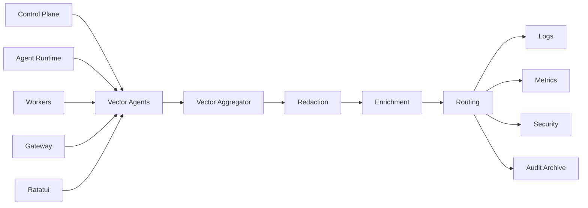

# 35. Ratatui Control Center

Ratatui menjadi operator interface utama.

## 35.1 Screens

* Overview;
* Organizations;
* Missions;
* Tasks;
* Agents;
* Swarms;
* Agent Lineage;
* Persistent Agents;
* Spawn Requests;
* Approvals;
* Workers;
* Policies;
* Memory;
* Skills;
* Artifacts;
* Costs;
* Logs;
* Incidents;
* Terminated Agent Archive.

## 35.2 Persistent Agent Screen

Menampilkan:

* lifecycle mode;
* uptime;
* current runtime;
* hibernation state;
* subscriptions;
* schedules;
* checkpoint;
* monthly cost;
* child teams;
* next review;
* policy version.

## 35.3 Example

```text
┌ Claw10 Control Center ───────────────────────────────────────────────┐
│ Organization: Teacher Portal                  Environment: Production │
├───────────────────┬───────────────────────────────────────────────────┤
│ PERSISTENT AGENTS │ ACTIVE SWARM                                      │
│                   │                                                   │
│ ● Director        │ Mission: Security Audit                           │
│ ● Ops Manager     │ Root: security-manager-01                         │
│ ○ Report Agent    │ Children: 6 active, 2 completed                   │
│ ● Monitor Agent   │ Depth: 2 / 3                                      │
│                   │ Budget: $7.20 / $15.00                            │
├───────────────────┼───────────────────────────────────────────────────┤
│ SPAWN REQUESTS    │ EXECUTION                                         │
│ SR-014 APPROVAL   │ Agent: database-specialist-03                     │
│ SR-015 VALIDATING │ Worker: sandbox-worker-07                         │
│ SR-016 DENIED     │ Tool: static_analysis.run                         │
├───────────────────┴───────────────────────────────────────────────────┤
│ [a] approve  [d] deny  [p] pause  [k] kill  [g] lineage  [l] logs     │
└───────────────────────────────────────────────────────────────────────┘
```

## 35.4 TUI Architecture

Gunakan pola:

```text
Event
→ Message
→ State Update
→ Command
→ Render
```

TUI tidak berkomunikasi langsung dengan worker. Semua command melewati Control API.

---

# 36. Vector Observability

Vector digunakan untuk:

* logs;
* structured agent events;
* metrics;
* security events;
* audit copies;
* worker telemetry.

OpenTelemetry digunakan untuk distributed tracing.

## 36.1 Topology



## 36.2 Required Fields

```json
{
  "timestamp": "2026-06-27T15:02:18Z",
  "tenant_id": "tenant-a",
  "mission_id": "mission-204",
  "task_id": "task-14",
  "agent_id": "agent-7F21",
  "parent_agent_id": "engineering-lead-01",
  "lineage_id": "lineage-204",
  "worker_id": "worker-07",
  "trace_id": "trace-001",
  "event_type": "agent.terminated",
  "lifecycle_mode": "ephemeral",
  "risk_level": "medium",
  "status": "success",
  "cost_usd": 0.42
}
```

Vector harus menghapus:

* passwords;
* tokens;
* cookies;
* API keys;
* authorization headers;
* private keys;
* sensitive tool arguments.

---

# 37. Data Architecture

Claw10 OS dirancang dengan pendekatan **local-first dan single-user**. Berikut adalah arsitektur penyimpanan data yang diimplementasikan saat ini serta rencana pengembangan skala besarnya:

## 37.1 Embedded Sled KV Store (Implementasi Saat Ini)

Untuk deployment lokal dan efisiensi resource, seluruh status entitas disimpan menggunakan **Sled** (embedded key-value database engine untuk Rust):
*   Menyimpan data `agent`, `mission`, `task`, `lineage`, `policy`, `budget`, `memory`, `skill`, `artifact`, dan metadata runtime secara lokal di bawah folder `~/.claw10/db/`.
*   Menyediakan abstraksi store yang terisolasi berdasarkan namespace.

> [!NOTE]
> Pada arsitektur skala besar (multi-tenant), Sled dapat digantikan atau disinkronkan dengan **PostgreSQL** untuk menyimpan metadata relasional yang kompleks.

## 37.2 Event Bus & Message Queue

*   **In-Memory Event Bus (InternalBus):** Digunakan secara default untuk komunikasi antar-tim agen dan memproses tugas di latar belakang (single-node).
*   **NATS JetStream (Opsional):** Dapat diaktifkan melalui feature-flag `nats` untuk skenario clustering, task dispatch terdistribusi, pengiriman perintah jarak jauh, dan failover antar-worker.

## 37.3 Vector Database (Semantic Memory)

Digunakan untuk semantic memory retrieval secara lokal guna memperkaya konteks agen.

## 37.4 Object & File Storage

*   Menggunakan sistem berkas lokal (file system) di folder `~/.claw10/` dan folder temporary `/tmp/claw10/` untuk menyimpan:
    *   File workspace agen.
    *   Artifact hasil eksekusi tugas.
    *   Jejak legacy agen yang dihentikan (terminated agent archive).

## 37.5 Secret Management

Menyimpan API Key, Token Bot Telegram, dan kredensial sensitif lainnya di dalam file environment lokal `~/.claw10/.env` yang dimuat secara otomatis oleh CLI saat startup.

---

# 38. Core Domain Entities

```text
Tenant
Organization
Department
HumanIdentity
ServiceIdentity
AgentIdentity
AgentGenome
AgentRuntime
AgentCheckpoint
AgentSubscription
AgentSchedule
AgentLineage
AgentLegacy
SpawnRequest
Mission
Task
TaskDependency
TaskLease
Approval
PolicyBundle
PolicyRule
Tool
ToolInvocation
Worker
WorkerCapability
ModelProvider
ModelProfile
Memory
Skill
SkillVersion
Artifact
Evidence
Budget
CostRecord
Reputation
Incident
AuditEvent
Channel
Session
```

---

