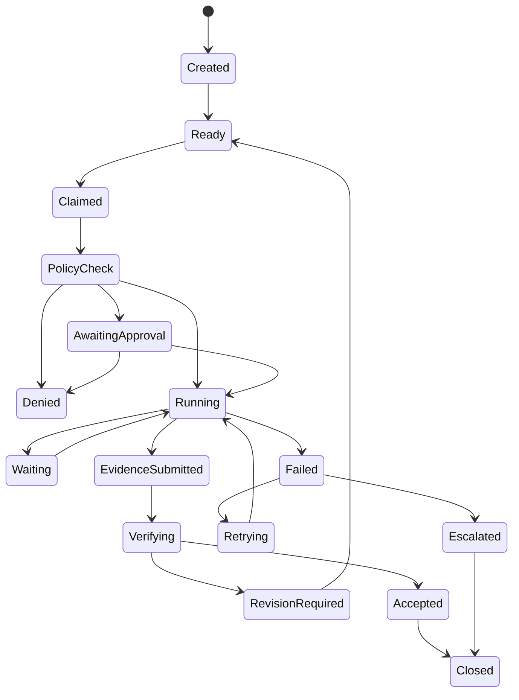
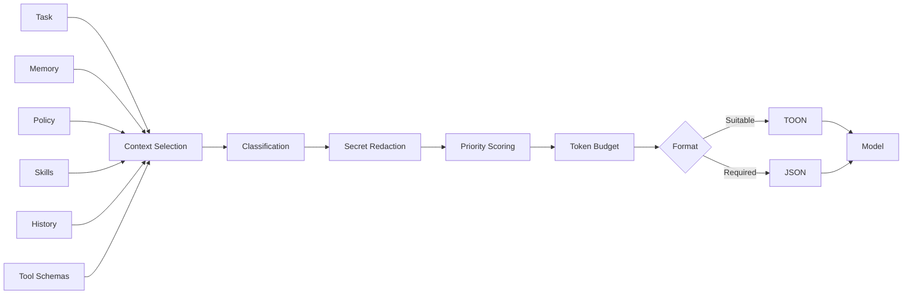
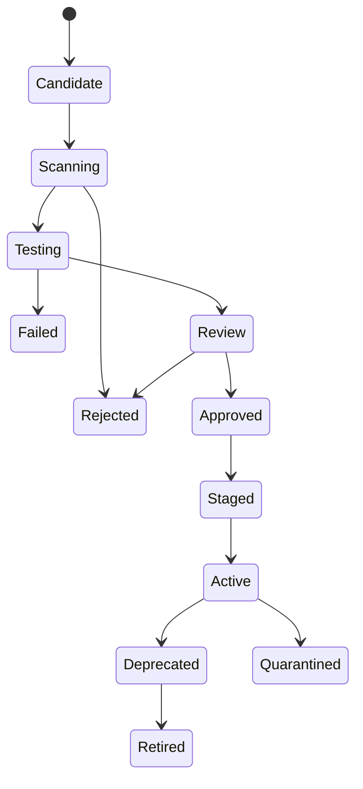

# 19. Mission Model

Mission memiliki:

* objective;
* owner;
* scope;
* constraints;
* lifecycle;
* budget;
* risk;
* deadline;
* required evidence;
* success criteria;
* termination criteria.

```yaml
api_version: claw10/v1
kind: Mission

metadata:
  id: mission-204
  organization_id: org-a

spec:
  objective: Maintain and improve the Teacher Portal

  lifecycle:
    mode: persistent
    campaign_end: null
    review_interval_days: 30

  budget:
    monthly_usd: 100
    hard_limit_usd: 120

  risk:
    default: medium

  acceptance:
    require_evidence: true
    minimum_verifiers: 1

  termination:
    manual: true
    inactivity_days: 90
```

---

# 20. Task Model

Setiap task memiliki:

* task ID;
* mission ID;
* parent task;
* objective;
* owner;
* dependencies;
* risk;
* budget;
* deadline;
* input;
* output contract;
* evidence contract;
* retry policy;
* idempotency key;
* lifecycle mode.

## 20.1 Task States



---

# 21. Scheduler

Scheduler bersifat deterministik.

Scheduler menangani:

* dependency;
* task lease;
* priority;
* agent capacity;
* model capacity;
* worker placement;
* budget reservation;
* deadline;
* retries;
* persistent schedules;
* hibernation;
* wake-up event.

## 21.1 Agent Assignment Score

```text
assignment_score =
    capability_match
    + role_match
    + reputation
    + data_locality
    + worker_availability
    + continuity_score
    - estimated_cost
    - active_load
    - risk_penalty
```

LLM dapat merekomendasikan assignment, tetapi scheduler membuat keputusan final.

---

# 22. Heartbeat and Event Model

## 22.1 Logical Agent Heartbeat

Menunjukkan:

* agent state;
* active task;
* child count;
* budget remaining;
* last checkpoint;
* policy version;
* runtime lease;
* health.

## 22.2 Worker Heartbeat

Menunjukkan:

* CPU;
* memory;
* active runtime;
* queue;
* tool availability;
* sandbox health;
* version.

## 22.3 Event-Driven Wake

Persistent Agent dapat berlangganan:

* webhook;
* queue event;
* database event;
* calendar schedule;
* filesystem event;
* monitoring alarm;
* user message;
* child completion;
* approval decision.

---

# 23. Context Engineering and TOON

## 23.1 Canonical Data

Internal canonical formats:

* Rust structs;
* PostgreSQL rows;
* JSON;
* Protobuf.

TOON tidak menjadi canonical storage format.

## 23.2 TOON Usage

TOON digunakan untuk:

* task context;
* agent roster;
* child context;
* memory digest;
* evidence summary;
* policy summary;
* structured tool result;
* cost summary.

## 23.3 Context Pipeline



## 23.4 TOON Fallback

Jika model gagal:

1. lakukan satu repair attempt;
2. fallback ke JSON;
3. catat failure;
4. perbarui suitability score.

---

# 24. ICVS Instruction and Policy Layer

## 24.1 Position

ICVS menjadi source authoring format.

Claw10 tidak mengeksekusi raw ICVS secara langsung.

```text
ICVS Source
→ Strict Parse
→ Cycle Detection
→ Reference Resolution
→ Conflict Detection
→ Internal Policy IR
→ Signature
→ Activation
```

## 24.2 Policy Subjects

Policy dapat berlaku untuk:

* tenant;
* organization;
* department;
* role;
* agent;
* mission;
* task;
* tool;
* worker;
* data class.

## 24.3 Policy Precedence

```text
System explicit deny
Tenant explicit deny
Organization explicit deny
Mission explicit deny
Task explicit deny
System allow
Tenant allow
Organization allow
Mission allow
Task allow
```

Explicit deny selalu menang.

## 24.4 Example ICVS

```ini
#project: "claw10-security"

[node: require_agent_identity]
  type = rule
  severity = must
  content = "Every action requires tenant, mission, task, and agent identity"

[node: restrict_child_permissions]
  type = rule
  severity = must
  content = "Child permissions cannot exceed parent delegable permissions"

[node: external_send_approval]
  type = condition
  if = $ACTION == "communication.send_external"
    then = -> require_human_approval
    else = -> continue_evaluation

[node: require_human_approval]
  type = action
  content = "Create scoped approval request"

[node: continue_evaluation]
  type = action
  content = "Continue deterministic evaluation"

[edge: require_agent_identity -> restrict_child_permissions]
[edge: restrict_child_permissions -> external_send_approval]

[target: claw10]
  resolve = [
    require_agent_identity,
    restrict_child_permissions,
    external_send_approval
  ]
```

---

# 25. Identity and Access Management

Setiap entity memiliki identity:

* human;
* agent;
* service;
* worker;
* tool;
* organization.

Authorization menggunakan:

* RBAC;
* ABAC;
* task scope;
* resource scope;
* time scope;
* risk context;
* data classification.

Child Agent tidak menerima parent credential.

Spawn Broker membuat identity baru dengan:

* unique ID;
* parent reference;
* mission reference;
* permission set;
* TTL;
* secret lease policy.

---

# 26. Human Approval

## 26.1 Approval Levels

| Level | Ketentuan                       |
| ----- | ------------------------------- |
| L0    | Otomatis                        |
| L1    | Deterministic policy approval   |
| L2    | Satu human approver             |
| L3    | Security or compliance approval |
| L4    | Dual human approval             |
| L5    | Dilarang                        |

## 26.2 Default Approval Actions

* external communication;
* production deployment;
* production data mutation;
* deletion;
* secret access;
* permission increase;
* policy activation;
* persistent agent creation;
* physical action;
* financial transaction.

## 26.3 Persistent Agent Approval

Pembuatan persistent agent baru membutuhkan approval jika:

* memiliki akses eksternal;
* memiliki recurring budget;
* berjalan lebih lama dari batas policy;
* dapat membuat persistent children;
* dapat menjalankan side effect.

---

# 27. Memory System

## 27.1 Memory Types

* working memory;
* episodic memory;
* semantic memory;
* procedural memory;
* user memory;
* organization memory;
* mission memory;
* agent continuity memory.

## 27.2 Memory Record

```yaml
id: memory-778
tenant_id: tenant-a
scope: mission/teacher-portal
type: semantic

content: Question update must use a transaction

source:
  agent_id: database-specialist-01
  task_id: task-14
  evidence_id: evidence-205

confidence: 0.94
classification: confidential
status: active
verified_by:
  - verifier-01
```

## 27.3 Admission Pipeline

```text
Candidate
→ Classification
→ Injection Scan
→ Deduplication
→ Source Check
→ Confidence Score
→ Scope Assignment
→ Verification
→ Activation
```

## 27.4 Persistent Memory Maintenance

Long-running agents require:

* periodic compaction;
* conflict detection;
* expiration;
* stale fact review;
* unused memory cleanup;
* source revalidation.

---

# 28. Skills System

A skill terdiri atas:

* purpose;
* input schema;
* output schema;
* steps;
* required tools;
* required permissions;
* test suite;
* safety rules;
* cost profile;
* version;
* signature.

## 28.1 Skill Lifecycle



Agen dapat membuat candidate skill. Agen tidak boleh mengaktifkannya sendiri.

---

# 29. Tool System

## 29.1 Tool Categories

* filesystem;
* shell;
* browser;
* HTTP;
* database;
* source control;
* communication;
* document;
* spreadsheet;
* media;
* cloud;
* infrastructure;
* hardware;
* MCP;
* custom API.

## 29.2 Side Effect Classes

| Class                  | Contoh                   |
| ---------------------- | ------------------------ |
| Read Only              | Membaca file             |
| Reversible Write       | Membuat draft            |
| Controlled Write       | Membuat branch           |
| External Communication | Mengirim pesan           |
| Production Mutation    | Mengubah sistem produksi |
| Destructive            | Menghapus data           |
| Physical               | Mengontrol perangkat     |

## 29.3 Tool Invocation

Setiap invocation harus membawa:

* tenant ID;
* mission ID;
* task ID;
* agent ID;
* worker ID;
* policy bundle;
* idempotency key;
* risk level;
* approval ID jika diperlukan.

---

# 30. Execution Fabric

## 30.1 Worker Types

* local;
* sandbox;
* remote;
* cloud;
* edge;
* device.

## 30.2 Default Isolation

* non-root;
* read-only base;
* temporary workspace;
* process limit;
* CPU limit;
* memory limit;
* execution timeout;
* network deny by default;
* egress allowlist;
* scoped secret lease.

## 30.3 Persistent Agent Runtime

Persistent identity tidak berarti persistent process.

Runtime dapat:

* dimulai saat event;
* dihentikan saat idle;
* dipindahkan;
* diperbarui;
* direplikasi secara terkendali.

Hanya satu active writer runtime yang boleh mengendalikan satu logical agent, kecuali policy mendukung coordinated replicas.

---

# 31. Omnichannel Gateway

Claw10 mendukung adapter untuk:

* terminal;
* REST;
* webhook;
* email;
* Telegram;
* WhatsApp;
* Slack;
* Discord;
* mobile application;
* internal event bus.

Setiap inbound message harus melewati:

1. sender authentication;
2. tenant resolution;
3. channel policy;
4. session routing;
5. attachment scan;
6. rate limit;
7. prompt injection classification.

---

# 32. Secure Teardown

## 32.1 Teardown Stages

### Freeze

Agent tidak menerima task atau tool baru.

### Handoff

Agent menyerahkan hasil dan unresolved issue.

### Verify

Verifier memeriksa output.

### Preserve

Sistem menyimpan legacy trace.

### Revoke

Sistem mencabut token, lease, credential, dan session.

### Destroy

Sistem menghapus process, container, workspace, cache, dan browser session.

### Seal

Sistem menutup lineage record dan audit hash.

## 32.2 Descendant Teardown

Jika parent dihentikan:

* descendant dibekukan;
* task dialihkan atau dibatalkan;
* final handoff diminta;
* credential dicabut;
* runtime dihentikan;
* forced legacy record dibuat.

Policy dapat mempertahankan descendant tertentu dengan melakukan reparenting yang disetujui.

---

# 33. Agent Legacy Trace

Setiap agent yang berakhir menghasilkan record.

```yaml
api_version: claw10/v1
kind: AgentLegacy

metadata:
  agent_id: agent-7F21
  parent_agent_id: engineering-lead-01
  lineage_id: lineage-204
  mission_id: mission-204

lifecycle:
  mode: ephemeral
  created_at: 2026-06-27T14:00:00Z
  terminated_at: 2026-06-27T14:14:31Z
  termination_reason: task_completed

execution:
  model_calls: 7
  tool_calls: 4
  children_created: 0
  cost_usd: 0.42

result:
  status: accepted
  artifact_ids:
    - artifact-101
  evidence_ids:
    - evidence-205

memory:
  proposed:
    - memory-candidate-09
  accepted:
    - memory-778

security:
  policy_denials: 0
  anomalies: []

integrity:
  trace_hash: sha256:abc123
  signed_by: control-plane
```

Persistent Agent juga menghasilkan periodic legacy snapshots.

---

# 34. Evidence and Verification

## 34.1 Evidence Types

* file;
* screenshot;
* test output;
* command result;
* API result;
* database diff;
* deployment health;
* source citation;
* human confirmation.

## 34.2 Completion Rule

```text
task_complete =
    output_contract_satisfied
    AND required_evidence_present
    AND verifier_accepts
    AND policy_compliant
    AND cost_recorded
    AND audit_persisted
```

---

